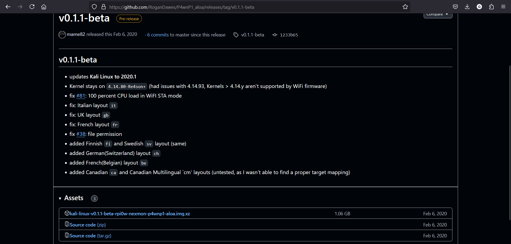
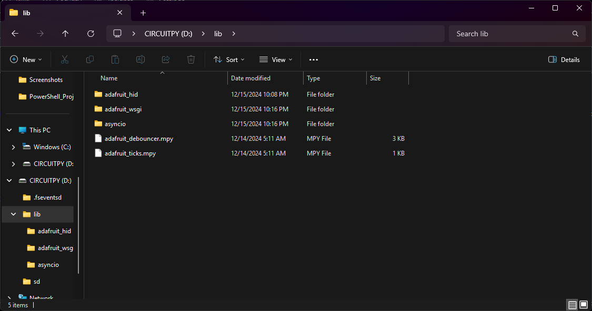

<h1>Hak5 Plugins</h1>

<h2>Description</h2>
Here we'll configure the Raspberry Pi Zero WH to act as a USB Rubber Ducky to grant a reverse shell. View my demo here --><a href="">Demo Video</a><--<br />

<b>Step 1: Configure the Pico</b><br/>
First, we need to download the image for the P4wnP1-A.L.O.A <a href="https://github.com/RoganDawes/P4wnP1_aloa/releases/tag/v0.1.1-beta">here</a>. 
<p align="center">
  
</p>
<b>Step 2: Move Circuit Python to the Pi</b><br/>
Move the circuit python file you downloaded onto the Raspberry Pi Pico. This will convert the Raspberry Pi Pico to Circuit Python.
<p align="center">
  
</p>
<b>Step 3: Additional Required Libraries</b><br/>
Next, download the libraries that will allow the Raspberry Pi Pico to act as an HID. Download <a href="https://github.com/adafruit/Adafruit_CircuitPython_Bundle/releases/tag/20241214">here</a>. 
<p align="center">
  
</p>
<b>Step 4: Copy Libraries and Files</b><br/>
Now, we'll copy the adafruit_hid, asyncio, and adafruit_wsgi folders from the zip file we just downloaded and copy it to the CircuitPy's lib folder. We also need the adafruit_debouncer.mpy and adafruit_ticks.mpy files in the lib folder
<p align="center">
  
</p>
<b>Step 5: Copying Additional Filesy</b><br/>
In the root directory of the CircuitPy we need the following files from the <a href="https://github.com/dbisu/pico-ducky/tree/main">pico-ducky</a> repo: boot.py, duckyinpython.py, code.py, webapp.py, and wsgiserver.py 
<p align="center">
  
</p>
<b>Step 6: Edit Payload</b><br/>
Last part of the setup involves creating our Ducky Script payload. Unlike the USB Rubber Ducky we do not need to encode the payload, we just need to modify the payload.dd file
<p align="center">
  
</p>
<h2>Languages and Utilities Used</h2>
 
- <b>USB Rubber Ducky</b>
- <b>DuckyScript</b>
- <b>PowerShell</b>

<h2>Environments Used </h2>

- <b>Windows 10</b>
- <b>Kali Linux</b>


<!--
 ```diff
- text in red
+ text in green
! text in orange
# text in gray
@@ text in purple (and bold)@@
```
--!>
