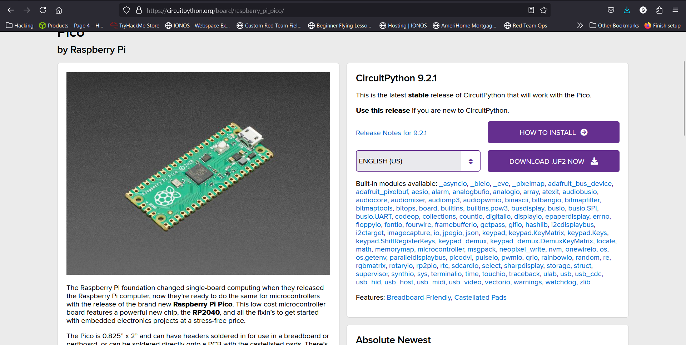

<h1>Hak5 Plugins</h1>

<h2>Description</h2>
Here we'll configure the Raspberry Pi Pico to act as a USB Rubber Ducky to disable Windows Defender and create a new Administrator user with Remote Management/Desktop privileges. View my demo here --><a href="">Demo Video</a><--<br />

<b>Step 1: Configure the Pico</b><br/>
First we need to download circuit python for the Raspberry Pi Pico from <a href="https://circuitpython.org/board/raspberry_pi_pico">here</a>. 
<p align="center">
  
</p>
<b>Step 2: Modify Code</b><br/>
Like I said the code is premade so we need to alter it to feed our needs. In my case, I want the script to disable Windows Defender and give my Kali Machine a reverse shell. I've made the modifications and saved the code in this repository <a href="./Disable_AV_RevShell.txt">(HERE)</a><br/><br/>
<b>Step 3: Encode Ducky Script</b><br/>
In order for Ducky Script to execute it must be encoded. You can encode the ducky script here: https://payloadstudio.hak5.org/community/. After it is encoded you can download the inject.bin file and replace the default file that is stored on the Rubber Ducky:
<p align="center">
  
</p>
<b>Step 4: Execute the Attack</b><br/>
Now the USB Rubber Ducky is ready for your attack. Note: The USB Rubber Ducky execute commands relatively quick so be generous with your DELAY commands to ensure your code executes properly.


<h2>Languages and Utilities Used</h2>
 
- <b>USB Rubber Ducky</b>
- <b>DuckyScript</b>
- <b>PowerShell</b>

<h2>Environments Used </h2>

- <b>Windows 10</b>
- <b>Kali Linux</b>


<!--
 ```diff
- text in red
+ text in green
! text in orange
# text in gray
@@ text in purple (and bold)@@
```
--!>
