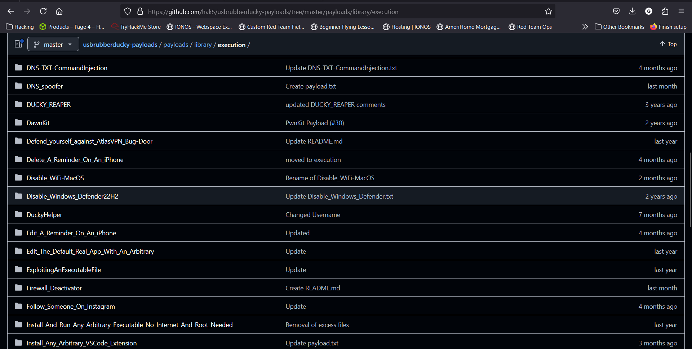
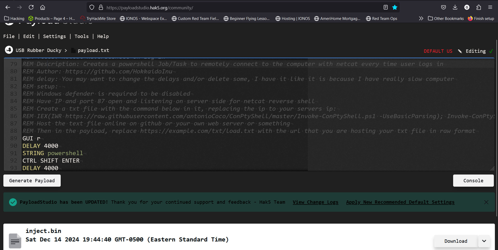

<h1>Hak5 Plugins</h1>

<h2>Description</h2>
Here we'll configure the USB Rubber Ducky to disable Windows Defender and make an HTTP request for a reverse shell script. View my demo here --><a href="https://youtu.be/Lwp7VJKKu5w?si=COM60IkqX5ZO7TK9">Demo Video</a><--<br />

<b>Step 1: Payload Development</b><br/>
For the USB Rubber Ducky there are several preconfigured payload that can perform singular task. They can be found <a href="https://github.com/hak5/usbrubberducky-payloads/tree/master/payloads">here</a>. 
<p align="center">
  
</p>
<b>Step 2: Encode the Payload</b><br/>
Next, we need to encode the payload.
<p align="center">
  
</p>
<b>Step 3: Store and Execute Attack</b><br/>
Now you need to store the inject.bin file to your USB rubber ducky. Once stored it's ready to execute an attack:


<h2>Languages and Utilities Used</h2>
 
- <b>USB Rubber Ducky</b>
- <b>DuckyScript</b>
- <b>PowerShell</b>

<h2>Environments Used </h2>

- <b>Windows 10</b>
- <b>Kali Linux</b>


<!--
 ```diff
- text in red
+ text in green
! text in orange
# text in gray
@@ text in purple (and bold)@@
```
--!>
