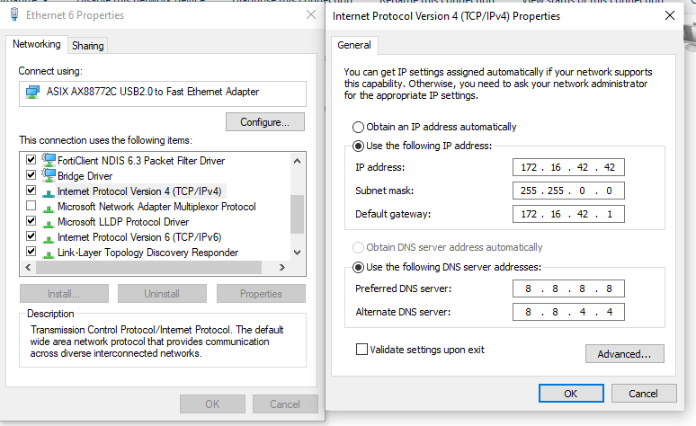
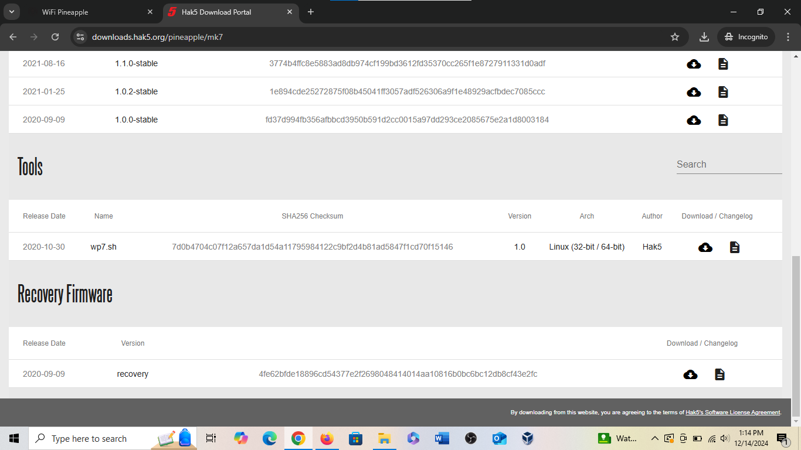
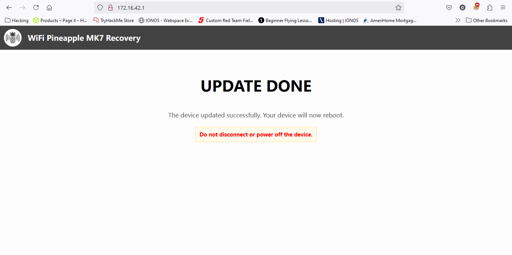

<h1>WiFi Pineapple Setup</h1>

<h2>Description</h2>
Here we'll configure the WiFi Pineapple during its intial setup to prepare it for WiFi Pentesting.<br />


<h2>Setup</h2>
<b>Step 1: Factory Reset</b> <br/>
After initially receiving the WiFi Pineapple I realized the firmware was out of date. So I had to factory reset it: <br/>
- Hold the reset button for about 4 seconds before supplying power. <br/>
- Continue to hold the reset button and supply power. <br/>
- After the RED light flashes three times, release the reset button. <br/>
- Once connected update the network configurations for the WiFi Pineapple Adapter <br/><br/>
<b>Step 2: Network Configuration</b>
Next you need to configure the network adapter for the WiFi Pineapple. It should look like the following:
<p align="center">
 <br/>
</p>
<b>Step 3:Firmware Download</b><br/>
Navigate to <a href="https://downloads.hak5.org/pineapple/mk7">Hak5 Download Portal</a> and Download the Recovery Firmware.<br/>
<p align="center">
 
</p>
<b>Step 4: Update the Firmware</b><br/>
Navigate to http://172.16.42.1 and select the Recovery tab:
<p align="center">
 
</p>


<!--
 ```diff
- text in red
+ text in green
! text in orange
# text in gray
@@ text in purple (and bold)@@
```
--!>
