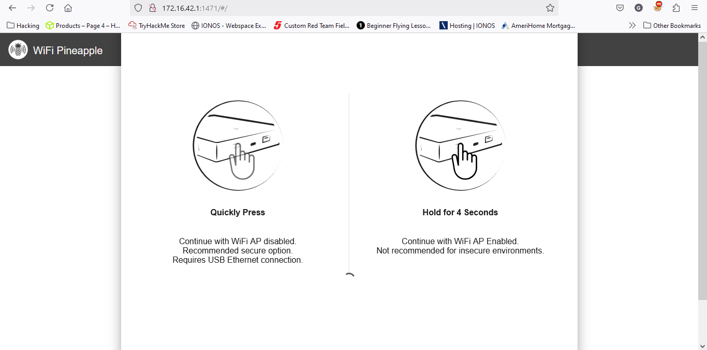
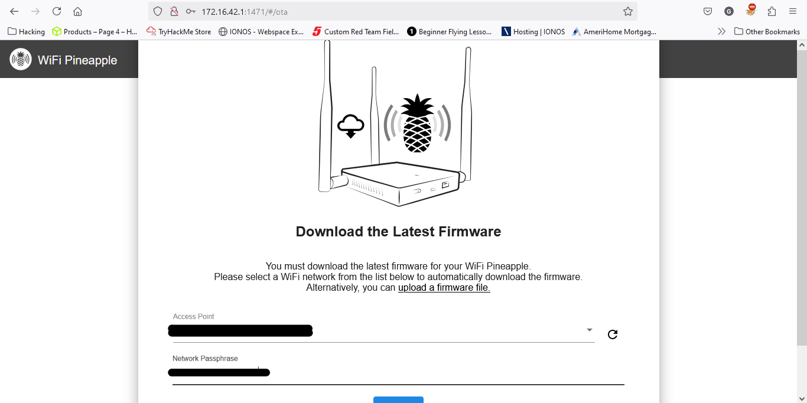
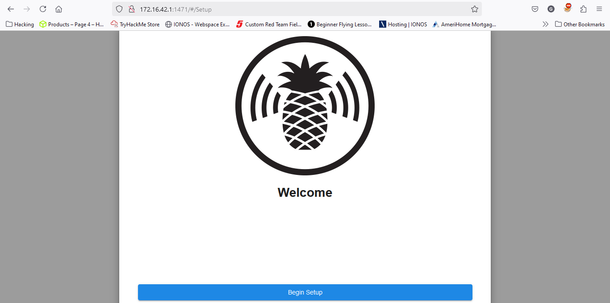
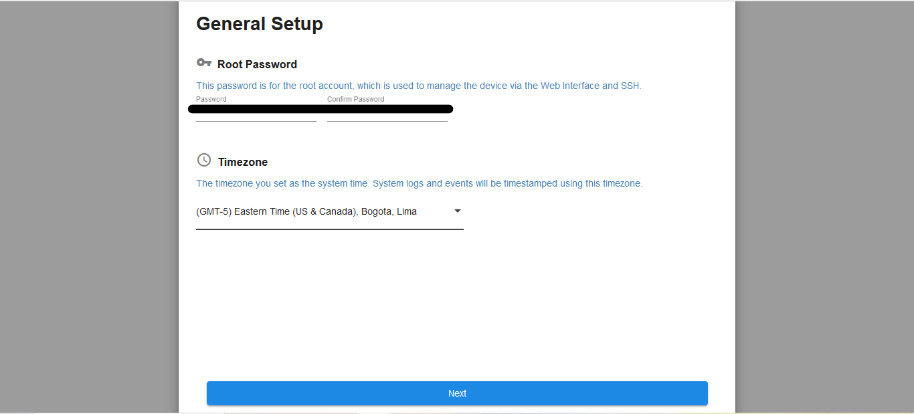
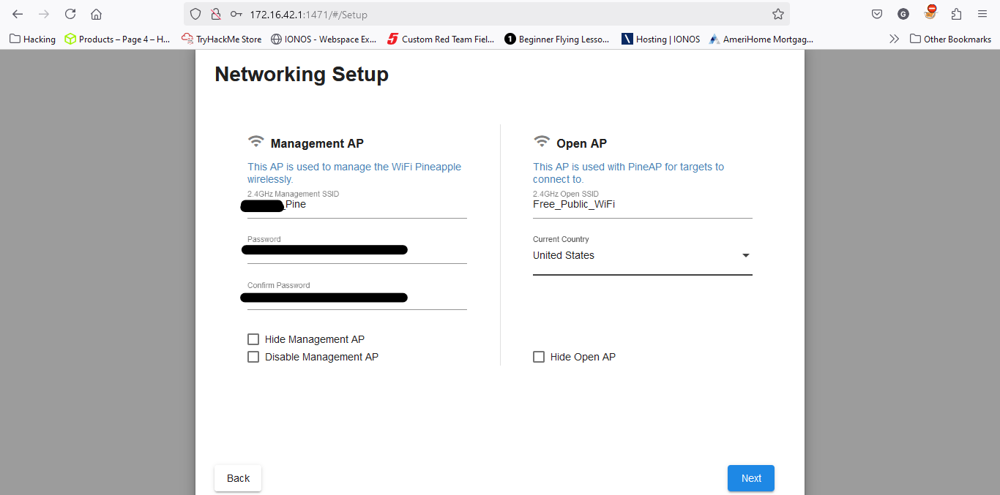
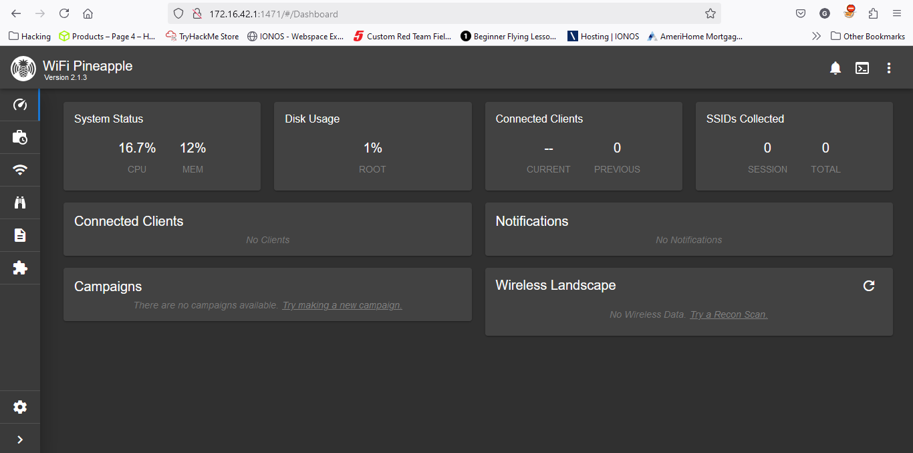

<h1>WiFi Pineapple Setup</h1>

<h2>Description</h2>
Here we'll configure the WiFi Pineapple during its intial setup to prepare it for WiFi Pentesting.<br />


<h2>Setup</h2>
<b>Step 1: Factory Reset</b> <br/>
After initially receiving the WiFi Pineapple I realized the firmware was out of date. So I had to factory reset it: <br/>
- Hold the reset button for about 4 seconds before supplying power. <br/>
- Continue to hold the reset button and supply power. <br/>
- After the RED light flashes three times, release the reset button. <br/>
- Once connected update the network configurations for the WiFi Pineapple Adapter <br/><br/>
<b>Step 2: Network Configuration</b>
Next you need to configure the network adapter for the WiFi Pineapple. It should look like the following:
<p align="center">
 <br/>
</p>
<b>Step 3:Firmware Download</b><br/>
Navigate to <a href="https://downloads.hak5.org/pineapple/mk7">Hak5 Download Portal</a> and Download the Recovery Firmware.<br/>
<p align="center">
 
</p>
<b>Step 4: Update the Firmware</b><br/>
Navigate to http://172.16.42.1 and select the Recovery tab. Select the recovery file that you downloaded and select upload. Once it's finished you'll be greeted by the following screen:
<p align="center">
 
</p>
<b>Step 5: Initial Setup</b><br/>
Once that is done, the WiFi Pineapple will reboot. Once the LED is a solid BLUE color Navigate to http://172.16.42.1:1471 for the intial setup window:
<p align="center">
 
</p>
<b>Step 6: Full Firmware Upgrade</b><br/>
My Pineapple was connected via USB Ethernet so I use the Quick Press option and was redirected to install the full firmware onto the WiFi Pineapple. You'll be required to give your network credentials to the WiFi Pineapple so it can download the firmware:
<p align="center">
 
</p>
<b>Step 7: Refresh</b><br/>
The WiFi Pineapple will reboot once the install is done and you'll need to refresh the page to get to the setup screen:
<p align="center">
 
</p>
<b>Step 8: Root Password</b><br/>
Next, we'll skip a few informational screens and come across the Set Root Password screen:
<p align="center">
 
</p>
<b>Step 9: Management and Open Network Setup</b><br/>
Now we'll set up the network that will allow us to remotely connect to the WiFi Pineapple and the Open Network for targets to connect to:
<p align="center">
 
</p>
<b>Step 10: Allow/Deny List</b><br/>
For the sake of simplicity we'll skip over this. If you would like to prevent certain devices from connecting to the WiFi Pineapple or if you want only certain devices to connect you can modify this table. <br/><br/>
<b>Step 11: Finish Setup</b>
Lastly, you must select Day or Night mode (not really a choice) and read and agree to the Terms and Agreements and the WiFi Pineapple will apply your configurations. Then you can navigate to the login page and login using the credentials you set:
<p align="center">
 
</p>


<!--
 ```diff
- text in red
+ text in green
! text in orange
# text in gray
@@ text in purple (and bold)@@
```
--!>
